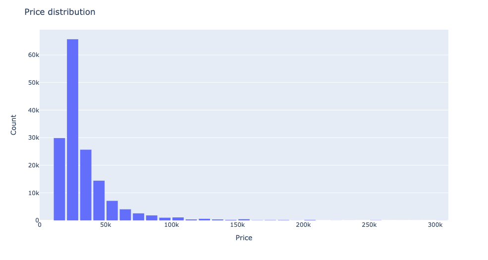

# Final-project

## Source data, statistics
The source data is rent dataset aggregated from [Yandex.Realty](http://Yandex.Realty) which contains data on the price of rent apartments in Saint Petersburg and their characteristics, such as area, number of rooms, floor, type of renovation, studio, etc. The dataset contains observations from 2014 to 2018 year.

This dataset was initially pre-processed and cleaned in order to avoid outliers and missing data, the data format and types was also structured.

| Column   |   Non-Null | Count   |  Dtype | 
| ------:  | :---------:|:---:    |   ---: |
|Price     |  155861    |non-null |float64 |
|Floor     | 155861     |non-null | int64  |
|Rooms     | 155861     |non-null |int64   |
|Area      | 155861     |non-null |float64 |
|Studio    | 155861     |non-null |bool    |
|Renovation| 155861     |non-null |float64 |

Some descriptive statistics:

|             | count    |	mean        | std	         | min     |	25%     |	50%     |	75%     |	max      |
| :-------    | :------: | :-----------:| :--------:   | :----:  | :----:   | :----:  | :----:  |      ---:|
| Price	      | 155861.0 | 32605.046432 |	24222.537415 |	9990.0 |	20000.0 |	25000.0 |	35000.0 |	650000.0 |
| Floor	      | 155861.0 | 6.687382     |	4.961438     |	1.0    |	3.0     |	5.0     |	9.0     |	30.0     |
| Rooms     	| 155861.0 | 1.605347     |	0.878962     |	0.0    |	1.0     |	1.0     |	2.0     |	5.0      |
| Area	      | 155861.0 | 53.690038    |	24.819141    |	11.0   |	38.0    |	46.0    |	62.0    |	200.0    |
| Renovation	| 155861.0 | 2.437127     |	4.043866     |	0.0    |	0.0     |	0.0     |	3.0     |	11.0     |


First of all, I checked the **distribution of price** and its correlation with other features.  
This distribution is a kind of zoom into price distribution, because I’ve cut too high prices in order to see more detailed graph. The histogram shows that price has **lognormal distribution**, so probably it is meaningful to use ln(price) in the models. 




Then I checked the connection between variables using **scatter plots** in order to grasp the whole tendency.  
It is seen, that there is positive correlation between price and area, price and rooms, which is very logical - the higher the area/rooms the higher the price. Also, the studios tend to have lower prices. The negative correlation is seen between floor and price - with higher floor, the price becomes lower. Finally, there is some differences in price depending on renovation type, however it is hardly interpretable. 


Next I wanted to take a look at **correlation matrix**, in order to understand which variables have correlation to avoid multicollinearity problem further.  
As we see, there is correlation between rooms, area, and living area, so they should not be used in the single model. But it is interesting to put them in two different models and check which one performs better. There is also correlation between studio and rooms, definitely because studio is always about only one room.


Another look at price, area and rooms features which clearly states the dependency.


Here I decided to split floors into three categories: low (lower than 5th), medium (5th-10th), high (higher than 10th). Here we see the tendency that mainly higher floors have much less average rent price than low or medium.


Finally, I checked the difference in days between first and last exposition days (need more details on what it means), which also can represent a valuable insight in connection with price.


---

## Model, framework, hyperparams

### Train-test split

In the models I use only part of dataset from 2016 to 2018.

- Train dataset: will be around 60% of the whole dataset -> from august 2016 to november 2017
- Test dataset: will be around 20% of the whole dataset -> from november 2017 to april 2018
- Holdout dataset: another 20% -> from april 2018 to august 2018

### Models

In the **first model**, I use gradient boosting on decision trees using **CatBoostRegressor** algorithm in order to predict price. As a target variable I use ln(price), and as features - studio, renovation, area, difference in expositions(in days). In case of first model, I tested several algorithms, such as Linear regression, Decision tree, Random forest, and CatBoost, and the CatBoost showed the best results in terms of RMSE and MAE. 

In order to choose parameters, I use the Grid Search to identify the best parameters of depth, learning rate (is used for reducing the gradient step. It affects the overall time of training: the smaller the value, the more iterations are required for training), and iterations. 

```python
# parameters for catboost

catboost_params = {'depth' : [4,5,6,7,8,9,10],
              'learning_rate' : [0.01,0.02,0.03,0.04],
              'iterations' : [50,100,500]
                 }

# grid search for catboost parameters

catboost_grid = GridSearchCV(estimator=CatBoostRegressor(random_seed = 0),
                             param_grid = catboost_params, 
                             cv = 3, 
                             scoring='neg_mean_squared_error',
                             refit=True,
                             verbose = 1)

catboost_grid.fit(X_train, y_train)
```

- Depth = 10
- Number of iterations = 500
- Learning rate = 0.03


In the **second model** I use other parameters: studio, rooms, floor, renovation and open plan. I do not use here day difference, area. As a target variable I use the same ln(price). In terms of algorithm, I use Random Forrest Regressor, because it showed pretty similar results to CatBoost. 

```python
# set parameters for random forest

max_depth_range = np.arange(1,20)
min_samples_leaf_range = np.arange(1,10)

params_grid = {'max_depth': max_depth_range,
             'min_samples_leaf': min_samples_leaf_range}
             
# grid search for random forest parameters

rf_grid= GridSearchCV(estimator = RandomForestRegressor(), 
                      param_grid = params_grid,
                      scoring = ['neg_mean_squared_error', 'neg_mean_absolute_error'],
                      cv = 3, 
                      verbose = 1,
                      refit='neg_mean_squared_error')
```

And the parameters are:

- Minimum samples leaf = 3
- Maximum depth = 7
- Number of estimators = 100

---

## How to install instructions and run an app with virtual environment & open the port in virtual environment

To run an app without docker in virtual environment, first of all,  enable the virtual machine and create virtual environment there, using the following commands:

```bash
sudo apt install python3.8-venv
python3 -m venv env
source env/bin/activate
```

Then pull the git repository with the app (Final-project) to your virtual environment. model1, model2 repositories, and requirements.txt, final_app.py files should be available there.

```bash
git clone git@github.com:annasemenova15/Final-project.git
```

After that install dependencies using requirements file.
Then enable port 5441 using the command:

```bash
sudo ufw allow 5441
```

After that the app can be launched in the Postman using the public Ip4v of your virtual machine and port (entering @'IP4V':5441/predict_price...).
Choose the model version and enter necessary parameters. If some of the parameters are not entered an error will be returned.

---

## Dockerfile and its content

```dockerfile
FROM ubuntu:20.04
MAINTAINER Anna Semenova
RUN apt-get upgrade -y
RUN apt-get update -y
COPY . /opt/model_predictor
WORKDIR /opt/model_predictor
RUN apt install -y python3-pip
RUN pip3 install -r requirements.txt
CMD python3 final_app.py
```
---

## How to run an app using docker

In order to run an app using docker, you need to pull the app from the [DockerHub](https://hub.docker.com/repository/docker/st095439/final_predictor) and run it:

```bash
#pull the image with web service
docker pull st095439/final_predictor:v.0.2

#run the image
docker run --network host -d st095439/final_predictor:v.0.2
```
The 5441 port is used here, so in order to run the app, you should enter the public Ip4v of your virtual machine and port 5441 in Postman.
